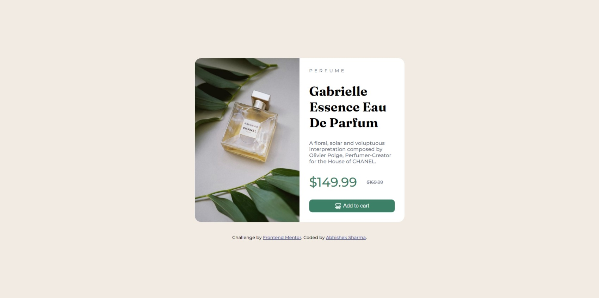

# Frontend Mentor - Product preview card component solution

This is a solution to the [Product preview card component challenge on Frontend Mentor](https://www.frontendmentor.io/challenges/product-preview-card-component-GO7UmttRfa). Frontend Mentor challenges help you improve your coding skills by building realistic projects. 

## Table of contents

- [Overview](#overview)
  - [Screenshot](#screenshot)
  - [Links](#links)
- [My process](#my-process)
  - [Built with](#built-with)
- [Author](#author)

## Overview

### Screenshot

### Links

- Solution URL: [Solution URL](https://github.com/abhisheksharma1310/frontend-challenges/tree/main/product-preview-card-component)
- Live Site URL: [Live site URL](https://abhisheksharma1310.github.io/frontend-challenges/product-preview-card-component/index.html)

### Built with

- Semantic HTML5 markup
- Sass
- Mixin
- Flexbox
- Media Query

## Author

- Portfolio - [Abhishek Sharma](https://abhisheksharma1310.github.io)
- Frontend Mentor - [@abhisheksharma1310](https://www.frontendmentor.io/profile/abhisheksharma1310)
